# Lab Report 1
*** 
## Intro Steps (Before you begin)
First and foremost, you will need the following before you begin the tutorial to ensure the smoothest and quickest set up.
These include:

1. Stable WiFi/internet connection
2. Laptop or Computer(Mac or Windows)
3. Have your UCSD account details ready with you (ucsd email, PID, and password)
***

## Setting up your CSE15L Account

**You'll need to look up your CSE 15L specific-account using this link: [CSE15L Account Lookup](https://sdacs.ucsd.edu/~icc/index.php).
It should bring you to a page that looks something like this:**

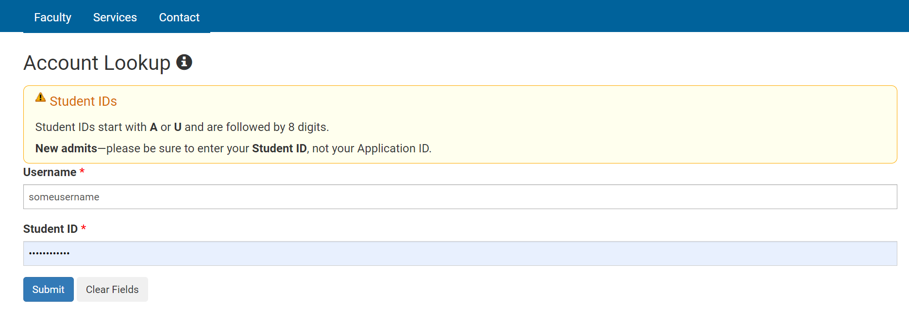

**Then you would need to log in to find your CSE15L account and reset its password and to do so, follow this well thought-out tutorial:** [How to reset your CSE 15L Password](https://drive.google.com/file/d/17IDZn8Qq7Q0RkYMxdiIR0o6HJ3B5YqSW/view)
* -You will need to wait at least 15 minutes to allow the change to fully take affect
* -I reccomend you save the name of your CSE 15L account as well as password somewhere or write it down as you will need to use both later on when remote connecting.
* **-Your are done for now, congratulations on setting up your CSE 15L account!!**
***

## Step #1: Installing and Setting up VsCode(Programming Software)

VsCode is a great programming software that allows you to write, edit and change any form of coding you decide to write. To download VsCode, you will need to [Click here to Download](https://code.visualstudio.com/).
The page it takes you to should look like this:

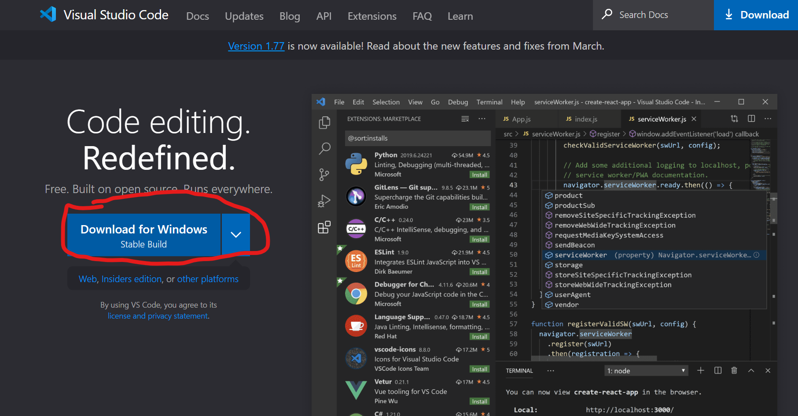

You need to click on the big blue button that says "Download for Windows" or clicking on the downarrow to change to appropriate computer system. Once you begin downloading, you will see this pop up at the bottom left of your page.

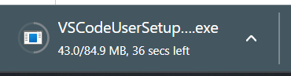

Once it finishes downloading, make sure to click on it and should open up its software screen-set up. Read or skim through the terms and service and just continue clicking **next** on every page that pops up untill you see the final install page which looks as following:

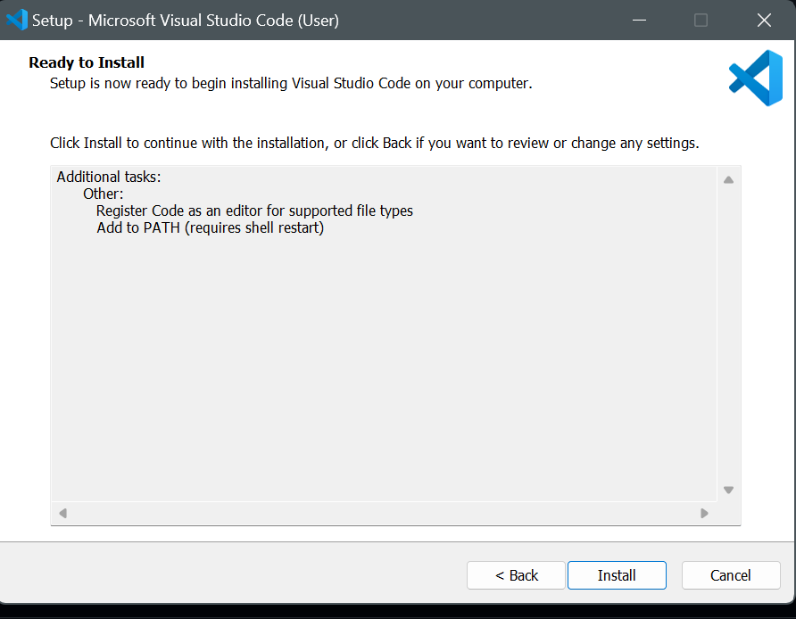

Once you click on the small **install** button at the bottom of its page, wait for the download to be complete so that you can then click on launch to finally open the VsCode programming software. You will know when you're done once you are taken to a page that looks like this (ignore black markings):

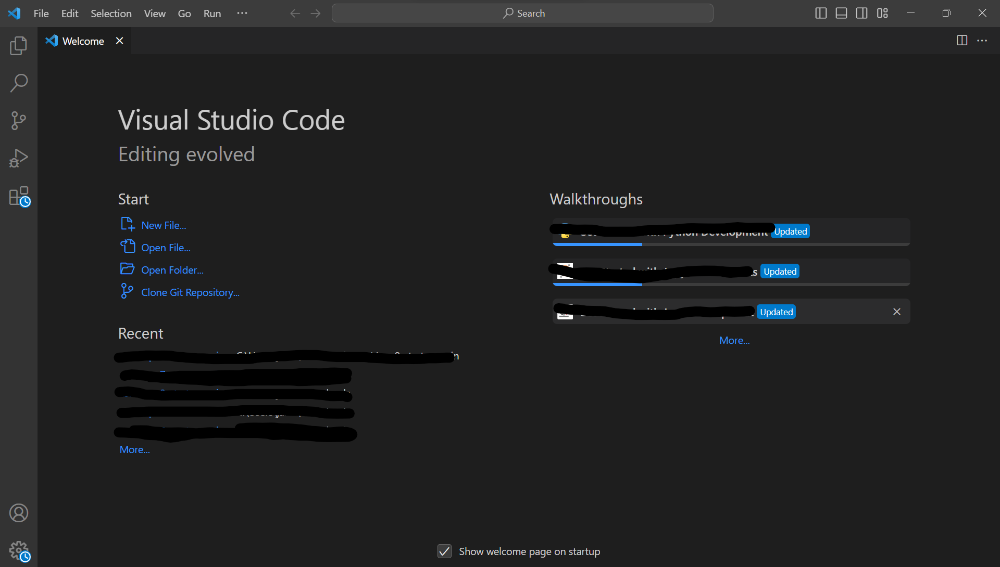

**You have now succesffuly installed the VsCode programming software on your PC and are ready to move on to the next steps!**
***

## Step #2: Remotely Connecting Your CSE 15L Account

Before we begin this process, the reason people should learn to connect to remote computer is that it will be used later on when working in jobs and is a great way to get used to working with the terminal. 

1. First you will need to install Git for windows (if on windows), [Click here to Download Git](https://gitforwindows.org/)
2. The Page will look something like this: 
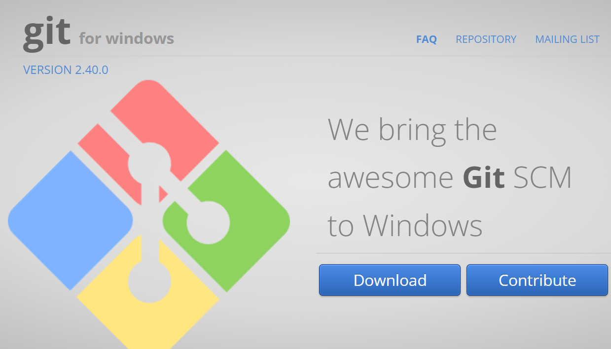
3. Click on the blue download button and wait for it to appear at the bottom left of your screen, and once it done, click on it again until you see its UI appear on the screen.
4. Click through until you get to its settings page which appears as:
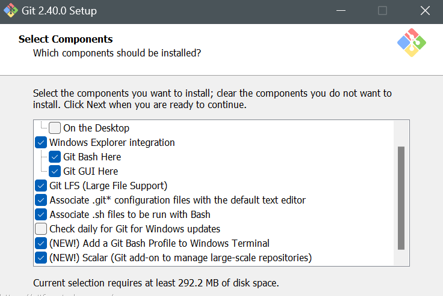

5. If it isn't already enabled, please enable the settings option "Add a Git Bash Profile to Windows Terminal". Some computers should be fine as if, but others such as my own did no work properly until I enabled that specific setting so it's just for reassurance.
6. Open VsCode up onto its homepage as you will now need it to set up Git Bash in your terminal. You should follow the instructions in the following link for a more straightforward guide for this set up [Click here to set up Git Bash on VsCode](https://stackoverflow.com/a/50527994)
7. Once you have the Git Bash in your terminal it should look like this (atleast for windows):

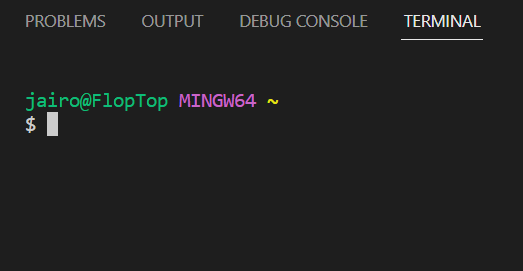

8. Incase you missed it, to open your terminal in VsCode after bash has been embedded is pressing Ctrl/Command and the symbol above the tab key. The `$` symbol is also something that should already be there and not something you have to type.
9. The text in green is my laptop name and my actual name, which if it does appear for you should also be different. This part of the terminal isn't too essential or important so if it doesn't show anything for you other than the `$` symbol, as long as later commands work then it should work fine regardless.
10. Now you wanna get your CSE 15L account from earlier, the one that's usually formatted as cs15lsp23xx (the xx being replaced by your own individual symbols) and add "@ieng6.ucsd.edu" after it. All together the email should look like: `cs15lsp23xx@ieng6.ucsd.edu`
11. Now you wanna type into the terminal, click to the right of the `$` symbol and type: `shh` + the `cs15lsp23xx@ieng6.ucsd.edu` email that you created from above so that it should look like this in the terminal:

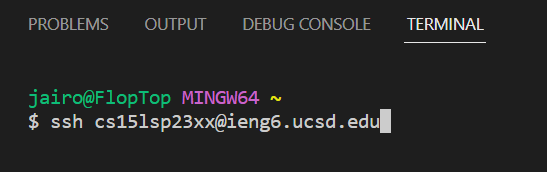 

12. Now press enter, and you should get a message such as:

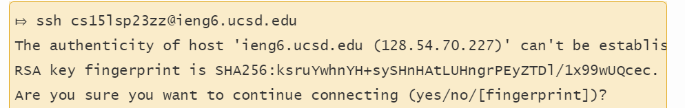

13. This message only appears if it's your first time logging in so you will have to type in `yes`
14. It will then ask for your password so use the password you typed in from the password change of your course-specific account and type it in. There are times where you would be typing in the password but it isn't showing anything, but if you just type it out and then press enter it should log you in regardless.
15. To know you have succesfully logged in, it will look like:

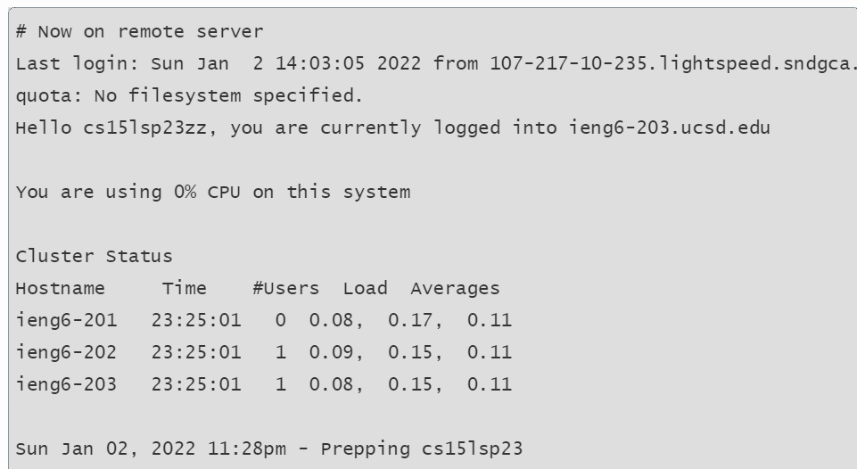

16. If the remote server is closed, it may not allow you to log into that specific server
17. **If you see that message or something similar, than your computer (client) has successfully connected into a remote computer in CSE (server) and now you can move onto trying new command lines to type in in the next step.**
***

## Step #3: Trying Some Commands in Terminal

Now that you have VsCode set up and are successfully remotely connected into a server, it's time to try some commands to check if you have done the previous steps right and are on the right path.

Here is a list of commands you can try (copy & paste if you have to):
```
cd
```
-Using the command `cd` would change the directory, if you have no such file with the name you specified after `cd` then nothing will occur.
```
cd ~
```
-Using the command `cd~` just returned me to the home directory so not much happened or there was no other outcome.
```
ls
```
-This gives you the basic list of your computer directories and files, great way to keep track of what files you are working with and if you are missing anything.
```
ls -lat
```
-The command `Ls -lat` seems to just give you a long list of files and the dates/times associated with them.
```
ls -a
```
-This option flag lists all files including hidden files starting with '.', great way to seek for files/directories hidden in others.
```
ls <directory>
```
-Works similar to other ls commands in the case that is seeks for a certain directory that you type in and finds the files within that directory, useful to know what is in each directory or related to it. An examples such as `/home/linux/ieng6/cs15lsp23/cs15lsp23abc`, where the abc is one of the other group members’ username is a way to use this.
```
pwd
```
-The `pwd` stands for Print Working Directory. It prints the path of the working directory, starting from the root and is a shell built-in command(pwd)
```
mkdir
```
-The `mkdir` command in Linux allows the user to create directories and can create multiple directories at once, setting the permissions for the directories.

Commands to try with other students as well in server:
```
cp
```
-The command `cp` is used to copy files or group of files or directory. It creates an exact image of a file on a disk with different file name, but requires at least two filenames in its arguments
```
cp /home/linux/ieng6/cs15lsp23/public/hello.txt ~/
```
-This is a way to use thie command `cp` which allows for the "hello" text to appear for everyone within the server/class.
```
cat /home/linux/ieng6/cs15lsp23/public/hello.txt 
or 
cat
```
-Cat is short for concatenate. This command displays the contents of one or more files without having to open the file for editing. You can view the contents of a file or use the command to direct in between. Can also combine files by appending one file’s contents to the end of another file, and create new files.

Typing these commands in should be as follows:

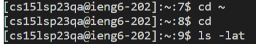
  
After typing and trying some of the commands above, you may get output such as this example below: 

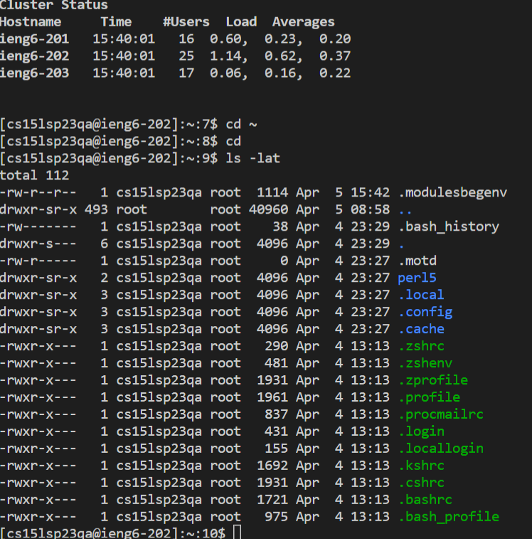
  
These commands are the basic ones used by almost every developer as its the most efficient way to view ones files, directories, make changes and more. Also can be used in remote servers and is a great thing to practicr with on your own time to hopefully understand how it works.
  
*Once you are finally done trying some of these commands or any other you are instructed to, you can now log out and exit from the remote server with typing in the simple command: "exit" or pressing CTRL + D.*
  
**CONGRATS, you just managed to go through with this tutorial and now know how to download and set up VsCode, your CSE 15L account for remote server connections, and even running certain commands.**

