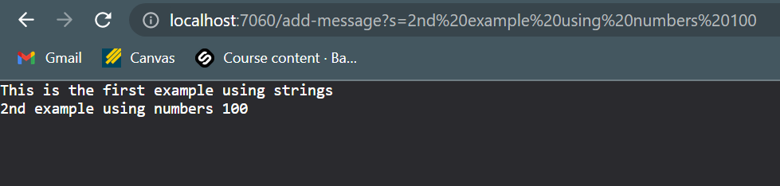
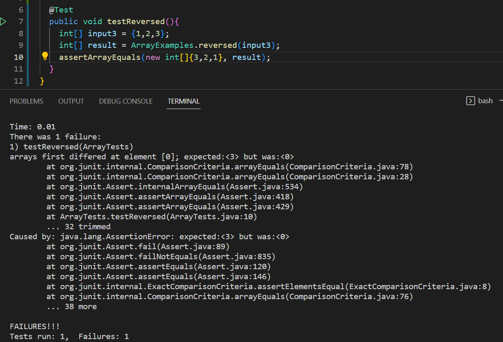
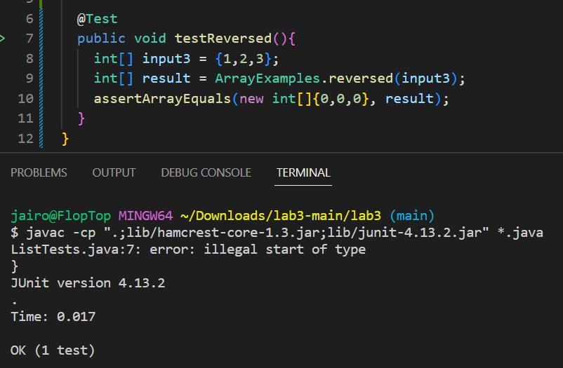

# Lab Report 2
***

## Part 1 (StringServer):
Below is my code for my StringServer web:


The functionality of the code is based off the port, you must first compile the code using the following commands in order:
```
$ javac Server.java StringServer.java
$ java StringServer.java 8000
```
**The number can be 8000 or any number from 1024 to 49151, just as I used 7060 as the port for the below examples**
**The purpose of the code is to concatenate a new line (\n) and the string after = in the web server link, which should then respond with the new string after each line on the page, you will see some examples I tried below.**

1. The number after StringServer.java is the port number that you must enter to have your web server be started up using that port. You can type any port number ranging from 1024 to 49151.
2. After you would get message such as this in your terminal which is a link that takes you to that server.

 

3. Since there is no `"/string?s=<message>` after the port number, the page by default would show `"No message yet"` 
4. We would have to add the String contents after the port number to see the codes output.

## Trying the add-message examples:
 **Below are two examples of the add-message tests to showcase how the code concate.**
 **When running both examples, a generalization of the used methods that are essential in the functionality of the code itself are as follows:**
1. `URI.getPath()`: This method returns the path component of the URI as a string.
2. `URI.getQuery()`: This method returns the query component of the URI as a string.
3. `String.split(String)`: This method splits the string into an array of substrings based on the specified delimiter and returns the resulting array.
4. `bString.equals(Object)`: This method returns true if the specified object is equal to this string, and false otherwise.
**In the StringServer class, the following methods are called:**
5. `Integer.parseInt(String)`: This method parses the specified string as a signed decimal integer and returns the result.
6. `Server.start(int, URLHandler)`: This method starts a server on the specified port and uses the specified URL handler to handle requests.

**First Example:**


* After you type this right after the port number in the URL search bar at the top:
```
/add-message?s=This is the first example using strings
```
* You would then get this as the output:


**I believe that the methods that are called when I write the port using `java StringServer 7060` in the terminal and then typing `add-message?s=This is the first example using strings` would have to be the following:**

* The main() method in the StringServer class is called with the port `7060` number as an argument. Whenever this number is changed, you would be opening the web server with another port using a different port number using the code lines below to initiate the website.
```
int port = Integer.parseInt(args[0]);
Server.start(port, new Handler());
```
* The start() method of the Server class is called with the port number and a new instance of the Handler class as arguments. This would change when you enter a new port, the link provided such as `localhost:<port>` is based on the port number you write. See above code.
* The handleRequest() method of the Handler class is called with the URI object representing the `new URI (/add-message?s=This is the first example using strings)` as an argument. This field would change as it takes in the URL string section after the localhost<port>, after that, it wouldn't change much.
**The relevant arguments to the handleRequest() method are:**
* website: a URI object representing the URL `/add-message?s=This is the first example using strings`. This changes the field value of website by allowing it to be processed through the commands in the handleRequest method body.
* The value of the message field of the Handler class is initially an empty string.
* When the handleRequest() method is called with the URI object representing the URL `/add-message?s=This is the first example using strings` , the following things happen:
* The getPath() method of the URI object returns "/add-message", which contains a forward slash, so the code inside the if statement is executed. This value could also change to any string such as a name of a URL change or numbers added, as long as they are behind the "?s=" is there it will split off from.
* The getQuery() method of the URI object returns `s=This is the first example using strings`, which is split into an array containing `s` and `This is the first example using strings`. The getQuery values could change such as the name before the `s` and the value after the `=` to another string that will then be added under in a new line from the past strings to be showcased on the screen.
* The code checks if the first element of the array is equal to `s`, which is true, so the second element of the array ("This is the first example using strings") is added to the message field, which becomes "This is the first example using strings\n". This value will be changed once you decide to change the string values.
* The Handler class implements the URLHandler interface and has a method called handleRequest() which takes a URI parameter and returns a String. Inside the handleRequest() method, it checks if the path of the URI contains a forward slash (/). If it does, it splits the query string by equals (=) sign and checks if the first element of the resulting array is equal to `s`. If it is, it adds the second element of the array to the message field and returns the message. If any of the conditions are not met, it returns "No message yet".

**Second Example:**


  
* You would erase the previous statemet `This is the first example using strings` and change it to `2nd example using numbers 100` after the `add-message/?s=` which should then concatenate onto a new line under the previous statement and displayed on the screen as shown below:
  
```
/add-message?s=2nd example using numbers 100
```


  
**Since the port has already been pre-determined from before, you wouldn't have to change or start another port web server, just changing the <message> section of /add-message?s=<message> to the next value you decide to change it too.

* The start() method of the Server class is called with the port number and a new instance of the Handler class as arguments. This time around, the port would npt change since the value of <port> would remain the same from below, we are only changing the value of <message> to display more on our page, not starting a whole other page with a different port.
* The handleRequest() method of the Handler class is called with the URI object representing the `new URI(/add-message?s=2nd example using numbers 100)` as an argument. This field would change as it takes in the URL string section after the localhost<7060>, after that, it would change from the past value of `/add-message?s=This is the first example using strings`.
**The relevant arguments to the handleRequest() method are:**
* website: a URI object representing the URL `/add-message?s=2nd example using numbers 100`. This changes the field value of website by allowing it to be processed through the commands in the handleRequest method body. It would be changed changed as there was a change in URL value from this next request.
* The value of the message field of the Handler class used to be the first request "This is the first example using strings", but now changes to the second request "2nd example using numbers 100".
* When the handleRequest() method is called with the URI object representing the URL `/add-message?s=2nd example using numbers 100` , the following things happen:
* The getPath() method of the URI object returns "/add-message" which has not changed as it uses the same path from the previous first example of the /add-message so there wouldn't be a change in paths unless we manually change it. Containing a forward slash, the code inside the if statement is executed. This value could also change to any string such as a name of a URL change or numbers added, as long as they are behind the "?s=" is there it will split off from.
* The getQuery() method of the URI object returns `s=2nd example using numbers 100`, which is split into an array containing `s` and `2nd example using numbers 100`. The getQuery values could change such as the name before the `s` and the value after the `=` to another string that will then be added under in a new line from the past strings to be showcased on the screen using the line of code below.
```
message += parameters[1] + "\n";
```
* The code checks if the first element of the array is equal to `s`, which is true, so the second element of the array ("2nd example using numbers 100") is added to the message field, which becomes `2nd example using numbers 100\n` which was done right after `This is the first example using strings\n`. This value will be changed once you decide to change the string values such as the one just provided that includes numbers.
* The Handler class implements the URLHandler interface and has a method called handleRequest() which takes a URI parameter and returns a String. Inside the handleRequest() method, it checks if the path of the URI contains a forward slash (/). If it does, it splits the query string by equals (=) sign and checks if the first element of the resulting array is equal to `s`. If it is, it adds the second element of the array to the message field and returns the message. If any of the conditions are not met, it returns "No message yet".
***
  
## Part 2 (Lab Bug):
  
Both the files ArrayExamples.java and ArrayTests.java were used for this section.
* The ArrayExamples.java file has two implementations of reverse methods `reverse` and `reverseInPlace` that seem to have had bugs at which we tested and fixed.
* The ArrayTests.java file has the tests at which we used to identify these bugs and write some of our own that helped in demonstrating these bugs and what solutions proposed to fix them.
  
**I will be going over the reversed method implementation:**
The purpose of the following method is to return an array of numbers that is in reversed order of what has been placed as the input.
  
**Failure inducing input for the buggy reversed method goes as follows:**
```
@Test 
  public void testReversed(){
    int[] input1 = {1,2,3};
    int[] result = ArrayExamples.reversed(input1);
    assertArrayEquals(new int[]{3,2,1}, result);
  }
```
The input1 array should have returned the array that was in `assertArrayEquals(new[]{5,5,5,3,1,1,1}, result)`, but it instead had an output of all zeros.
  
**An input that does not induce a failure according to past outputs:**
```
@Test 
  public void testReversed(){
    int[] input1 = {1,2,3};
    int[] result = ArrayExamples.reversed(input1);
    assertArrayEquals(new int[]{0,0,0}, result);
  }
```
The input matches what the buggy method was doing, which is in replacing all values with 0's, thus it ran and matched with the assertArrayEquals value.

**Symptom of running both tests from above:**
 
* This is the output of running with the input being `{1,2,3}` and expecting `{3,2,1}` in the `assertArrayEquals` to check if it matches, which turned out to fail as seen below:
  


* This is the output of running with the input '{1,2,3}` which is same as above, but expecting `{0,0,0}` and once it ran, it passed the tests and turned out to successfully match put the input and expected output.
  

  
I feel the symptom of the buggy reversed program is expecting and changing the output to be empty array or simply replacing all of the values with 0, when it should instead be reversing the order of the array.

**Buggy program before (as it is default):**
```
public class ArrayExamples {
static int[] reversed(int[] arr) {
    int[] newArray = new int[arr.length];
    for(int i = 0; i < arr.length; i += 1) {
      newArray[i] = arr[newArray.length - i - 1];
    }
    return arr;
  }
 ```
 
 **Buggy programed code now fixed (Working as it should):**
 ```
 public class ArrayExamples {
 static int[] reversed(int[] arr) {
     int[] newArray = new int[arr.length];
    for(int i = 0; i < arr.length; i += 1) {
      newArray[i] = arr[arr.length - i - 1];
    }
    return newArray;
  }
 ```
 **Bug fixes:** 
* Swapped arr and newArray	
* Was incorrectly changing the Array values within array

The old buggy program deviates from its purpose by assigning newArray’s value back to the input array such as replacing without the new values in their correct index. So the bug will be the “assigning strategy”. The bug in reversed is that the arr in arr[i] should be replaced with newArray in newArray[arr.length - i - 1] in the for loop because newArray has no elements, and so arr would be filled up with empty elements which is why the output was all swapped with 0's. The solution for reversed would be to switch newArray and arr so that the newArray would be filled up with elements from arr going from the end to the front. With the fix, it should correctly evaluate through the newArray and add the values in reverse order.
***
  
## Part 3 (What I learned):

Week 2:
* One of the first things I did not know before but got to learn how to set up a github desktop, cloning a repository that you get and being able to open it and edit with VsCode, or any other program editor. You can also save your new changes to the files inside the repositories and you'll be able to update it for later use, which is what I did when loading back my code for the ArrayExamples.
* I also learned about building and running a server with code that handles the URL and how to set up and change ports for local hosts as well as when connecting to them from remote servers that could have been made from other students.. I felt this part was essential in the lab, as we got to play around and learn the basics about URLs and how paths and queries are a large part of it and how we could change it so that our url outputs strings or number changes.
* Commit to master in github desktop and Push to origin so that your code changes done are saved to your github.
* I never knew things such as basic accessing to URLs with command lines such as `curl https://raw.githubusercontent.com/ucsd-cse15l-w23/WhereAmI/main/WhereAmI.java` and how to access with the curl command from local computers and remote access.
 
As for Week 3:
* We went in more depth to our creation/implementation of a simple web server to track a list of strings. I did struggle a bit as I was still struggling to understand how the NumberServer.java web server worked so that I could code my own above, so I decided to follow the same format to make it as simple as possible and get the output working as needed. This allowed me understand how to change messages and string so that it would display on a page and honestly learning how to work around the page was pretty interesting an kept me intrigued. 
* I felt this week was wonderful in taking a stab at recognizing bugs/errors in code, know the symptoms of the bugs and find ways to solve these bugs. It was great that we got to work with teammates to share the work load and to have more brain power in brainstorming these analytics. I feel this all served a great way in finding methods we are comfortable with to help shorten our time dealing with these tasks and acknowledging where I need to continue practicing in hopes I can reach a level of understanding to which I would feel confident fixing these issues alone.

  

