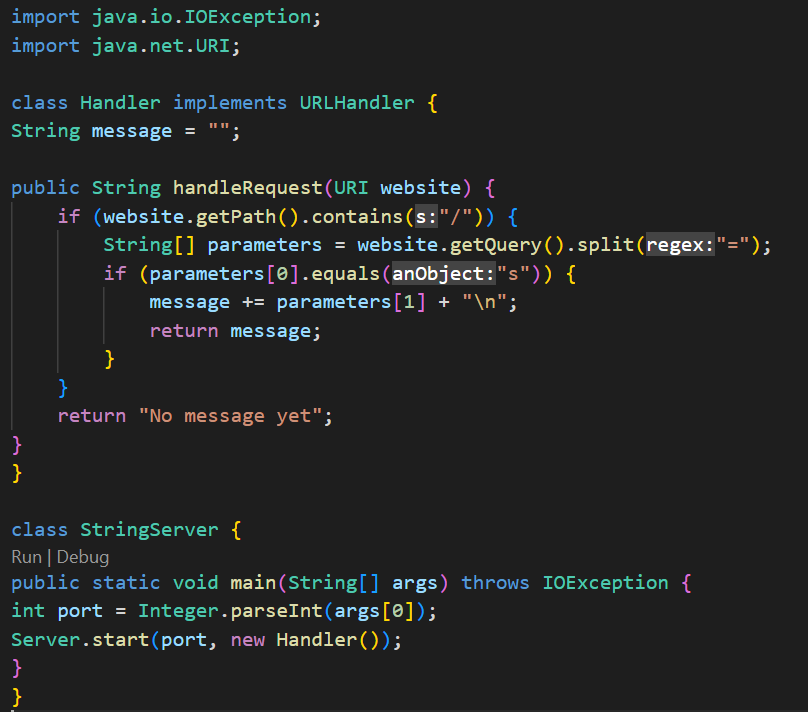
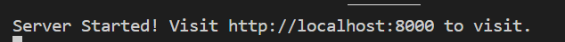
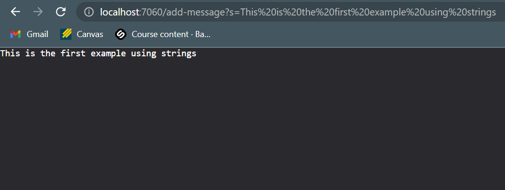

# Lab Report 2
***

## Part 1 (StringServer):
Below is my code for my StringServer web:



The functionality of the code is based off the port, you must first compile the code using the following commands in order:
```
$ javac Server.java StringServer.java
$ java StringServer.java 8000
```
**The purpose of the code is to concatenate a new line (\n) and the string after = in the web server link, which should then respond with the new string after each line on the page, you will see some examples I tried below.

1. The number after StringServer.java is the port number that you must enter to have your web server be started up using that port. You can type any port number ranging from 1024 to 49151.
2. After you would get message such as this in your terminal which is a link that takes you to that server.

 

3. Since there is no `"/string?s=<message>` after the port number, the page by default would show `"No message yet"` 
4. We would have to add the String contents after the port number to see the codes output.

## Trying the add-message examples:
 **Below are two examples of the add-message tests to showcase how the code concate.
 **When running both examples, a generalization of the used methods that are essential in the functionality of the code itself are as follows:**
1. `URI.getPath()`: This method returns the path component of the URI as a string.
2. `URI.getQuery()`: This method returns the query component of the URI as a string.
3. `String.split(String)`: This method splits the string into an array of substrings based on the specified delimiter and returns the resulting array.
4. `bString.equals(Object)`: This method returns true if the specified object is equal to this string, and false otherwise.
**In the StringServer class, the following methods are called:**
5. `Integer.parseInt(String)`: This method parses the specified string as a signed decimal integer and returns the result.
6. `Server.start(int, URLHandler)`: This method starts a server on the specified port and uses the specified URL handler to handle requests.

First Example:


* After you type this right after the port number in the URL search bar at the top:
```
/add-message?s=This is the first example using strings
```
* You would then get this as the output:



**I believe that the methods that are called when I write the port using `java StringServer 7060` in the terminal and then typing `add-message?s=This is the first example using strings` would have to be the following:**

* The main() method in the StringServer class is called with the port `7060` number as an argument.
* The start() method of the Server class is called with the port number and a new instance of the Handler class as arguments. This would change when you enter a new port, the link provided such as `localhost:<port>` is based on the port number you write.
* The handleRequest() method of the Handler class is called with the URI object representing the URL /add-message?s=Hello as an argument.
**The relevant arguments to the handleRequest() method are:
* website: a URI object representing the URL /add-message?s=Hello. This changes the field value of website by allowing it to be processed through the commands in the handleRequest method body.
* The value of the message field of the Handler class is initially an empty string.
**When the handleRequest() method is called with the URI object representing the URL /add-message?s=This is the first example using strings, the following things happen:
* The getPath() method of the URI object returns "/add-message", which contains a forward slash, so the code inside the if statement is executed.
* The getQuery() method of the URI object returns `s=This is the first example using strings`, which is split into an array containing `s` and `This is the first example using strings`.
* The code checks if the first element of the array is equal to `s`, which is true, so the second element of the array ("This is the first example using strings") is added to the message field, which becomes "This is the first example using strings\n".
* The Handler class implements the URLHandler interface and has a method called handleRequest() which takes a URI parameter and returns a String. Inside the handleRequest() method, it checks if the path of the URI contains a forward slash (/). If it does, it splits the query string by equals (=) sign and checks if the first element of the resulting array is equal to `s`. If it is, it adds the second element of the array to the message field and returns the message. If any of the conditions are not met, it returns "No message yet".
