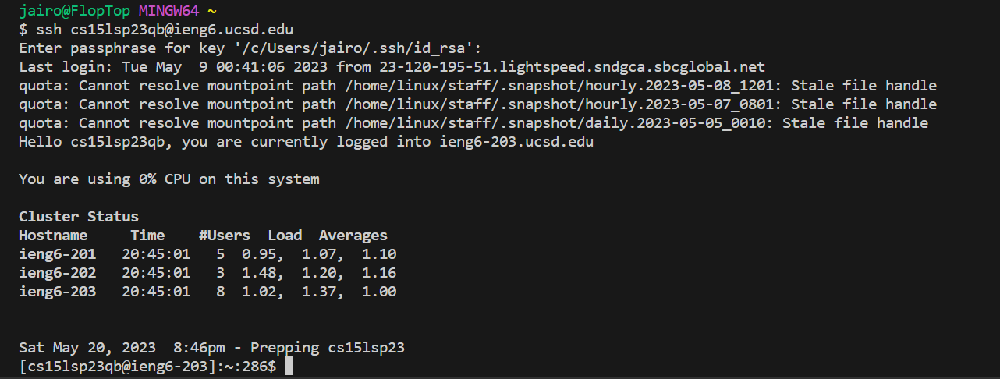
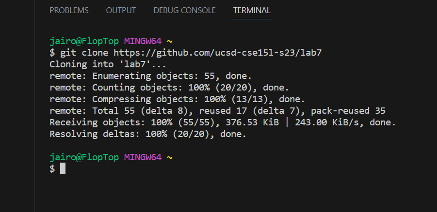
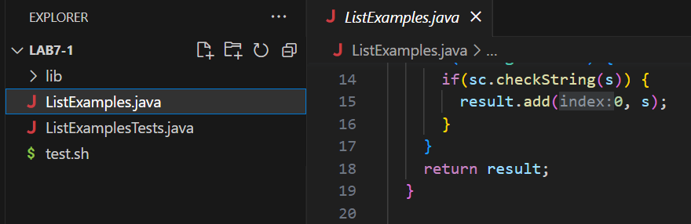
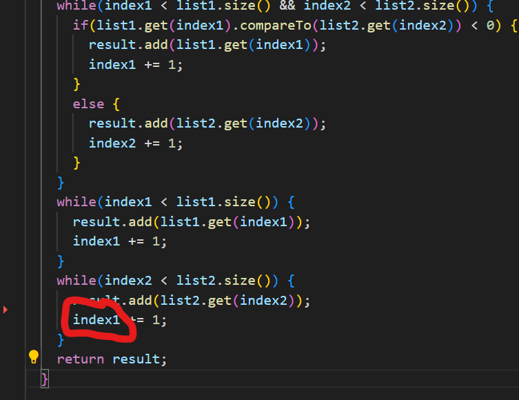
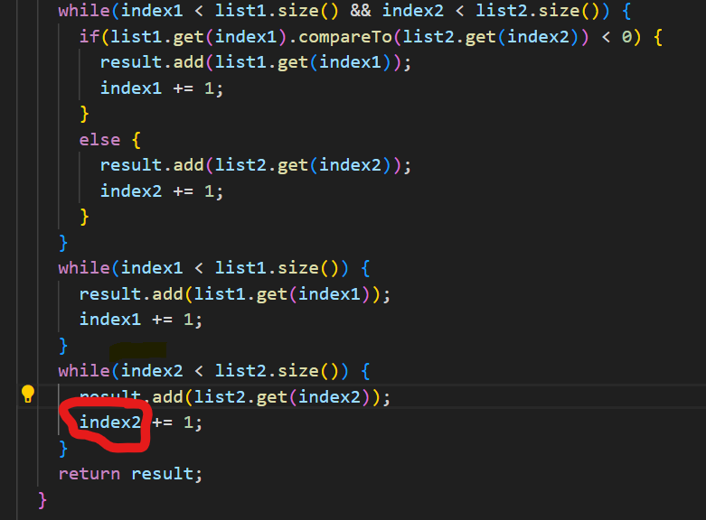

# Lab Report 4
***

## Step 1: Logging into ieng6

For this step I did the following keypresses: `<up><up><enter>` The `ssh cs15lsp23qb@ieng6.ucsd.edu` was up two in the command history, so the arrows allowed me to access it quicker. Then I did: `<t><o><j><i><enter>` to login into my remote account using my key-phrase rather than usual passwords.
***

## Step 2: Cloning fork of Repository 

There are two ways to get this step done.

1. Using the terminal:

Here I went into the github repository to copy the link "https://github.com/Jaibroo/lab7.git" `<Ctrl-C>` and then paste along with `<g><i><t><space><c><l><o><n><e><Ctrl-V><enter>` which would ultimately clone the code into the current terminal and work onto the correct path.

2. Using the command-line:

Here I copied the link from the github repository `<Ctrl-C>` and went on to the clone repository option on VsCode and `<Ctrl-V><enter>` to sucessfully copy over the code and be able to see and edit the code much easier and to have a clone of it.
***

## Step 3: Running Tests (demonstrating which fail)

## Step 4: Fixing the code file

The problem with the code was that the code section focused on `index2`, was adding `1` to `index1` rather than the correct index which was when we changed it to `index2`.

Before Fix (the error):

**Cirlced area is the error**

After fix (working code):

To fix the code I did the following: `<v><i><m>< > <L><i><s><t><E><x><a><m>
<l><e><s><.><j><a><v><a><enter>` this would take me into the vim simulator on the file that I am currently working on fixing (ListExamples.java), and then I would `<esc>` which allows me to type and find text such as: `</><w><h><i><l><e><(><i><n><d><e><x><2><enter>` which would end up taking me to the line of code where the error exists and then to move: `<j><j><j><L><L>`, then once i'm on the first character of `index1` I would press `<c><w>` which clears the word completely so then I would type `<i><n><d><e><x><2>` to fix/replace the old index and allow the code to work. `<esc>` gets us back into normal mode so that we could finally save my work using `<:><w><q><enter>`.

