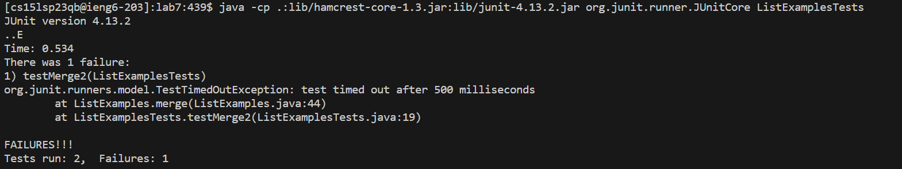
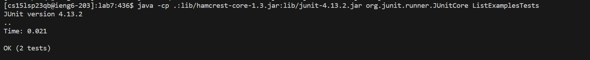
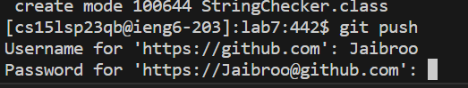

# Lab Report 4
***

## Step 1: Logging into ieng6

For this step I did the following keypresses: `<up><up><enter>` The `ssh cs15lsp23qb@ieng6.ucsd.edu` was up two in the command history, so the arrows allowed me to access it quicker. Then I did: `<t><o><j><i><enter>` to login into my remote account using my key-phrase rather than usual passwords.
***

## Step 2: Cloning fork of Repository 

There are two ways to get this step done.

1. Using the terminal:

Here I went into the github repository to copy the link "https://github.com/Jaibroo/lab7.git" `<Ctrl-C>` and then paste along with `<g><i><t><space><c><l><o><n><e><Ctrl-V><enter>` which would ultimately clone the code into the current terminal and work onto the correct path.

2. Using the command-line:

Here I copied the link from the github repository `<Ctrl-C>` and went on to the clone repository option on VsCode and `<Ctrl-V><enter>` to sucessfully copy over the code and be able to see and edit the code much easier and to have a clone of it.
***

## Step 3: Running Tests (demonstrating which fail)

In order to show that the tests file isn't working accordingly, we must compile and run the code all together which its outcome should look like:

In order to compile and prove the errors exist, I first started by changing the current directory to be the lab7 directory so that the files are all in the same path which is done by using `<c><d><space><l><a><b><7>`. After I would use `<up><up><enter>` which is used to find the `javac -cp .:lib/hamcrest-core-1.3.jar:lib/junit-4.13.2.jar *.java` command which was 2 up in the search history which was much quicker to look for than to type it using up arrows. The use: `<up><enter>` for the command `java -cp .:lib/hamcrest-core-1.3.jar:lib/junit-4.13.2.jar org.junit.runner.JUnitCore ListExamplesTests` which is used to compile the code and was only 1 up in the search history so I just accessed it the same way. The output after pressing that last enter was the errors.
***

## Step 4: Fixing the code file

The problem with the code was that the code section focused on `index2`, was adding `1` to `index1` rather than the correct index which was when we changed it to `index2`.

Before Fix (the error):

**Cirlced area is the error**

After fix (working code):

To fix the code I did the following: `<v><i><m>< > <L><i><s><t><E><x><a><m>
<l><e><s><.><j><a><v><a><enter>` this would take me into the vim simulator on the file that I am currently working on fixing (ListExamples.java), and then I would `<esc>` which allows me to type and find text such as: `</><w><h><i><l><e><(><i><n><d><e><x><2><enter>` which would end up taking me to the line of code where the error exists and then to move: `<j><j><j><L><L>`, then once i'm on the first character of `index1` I would press `<c><w>` which clears the word completely so then I would type `<i><n><d><e><x><2>` to fix/replace the old index and allow the code to work. `<esc>` gets us back into normal mode so that we could finally save my work using `<:><w><q><enter>`.
***

## Step 5: Running tests to show code works

This step is very similar to when we first ran step 3 in finding the existence of errors, but this time we will type the same commands again in same order to show that after being compiled once again, the tests should run successfully. Here's how the output should look like once the code works: 

I would do the follwing codes again: `<up><up><enter>` to compile `javac -cp .:lib/hamcrest-core-1.3.jar:lib/junit-4.13.2.jar *.java`, and `<up><enter>` to run `java -cp .:lib/hamcrest-core-1.3.jar:lib/junit-4.13.2.jar org.junit.runner.JUnitCore ListExamplesTests` which now compiles the and saves the new code changes done to use that fixed version in running the tests.
***

## Step 6 (Final): Commiting and Pushing changes to GitHub account

For this final step, after you have seen that the tests work and the code compiles successfully as expected, you should now commit and push your changes to be saved to your github account. 

To do this process firsy you must type: `<g><i><t><space><a><d><d><space><.><enter>`, you are instructing Git to include all changes, whether new, modified, or deleted, in the current directory and its subdirectories through the symbol `.` which represents the current directory. Next you wanna do: `<g><tab>` (finishes the word) `<space><c><o><m><m><i><t><space><-><m>`, the following can be any string message you decide to have to represent these changes in your github repository: `<n><e><w><space><c><h><a><n><g><e><s><enter>` which is the string "new changes". Next to push you wanna type: `<g><tab><space>
<u><s><h><space><o><r><i><g><i><n><space>` and after to any branch or main such as `<m><a><i><n>` which would complete the push. If you run into some instance such as myself where it asks for your github details, provide it your user and the password to your account to verify your information (only if needed).
***

# All Together (Key-presses):

1. `<up><up><enter><t><o><j><i><enter>`
2. 
* `<Ctrl-C><g><i><t><space><c><l><o><n><e><Ctrl-V><enter>`
* `<Ctrl-C><Ctrl-V><enter>`
3. `<c><d><space><l><a><b><7><up><up><enter><up><enter>`
4. `<v><i><m><space><L><i><s><t><E><x><a><m>
<l><e><s><.><j><a><v><a><enter></><w><h><i><l><e><(><i><n><d><e><x><2><enter><j><j><j><L><L><c><w><i><n><d><e><x><2><:><w><q>    <enter>`
5. `<up><up><enter><up><enter>`
6. `<g><i><t><space><a><d><d><space><.><enter><g><tab><space><c><o><m><m><i><t><space><-><m><n><e><w><space><c><h><a><n><g><e><s><enter><g><tab><space>
<u><s><h><space>   <o><r><i><g><i><n><space><m><a><i><n>`

