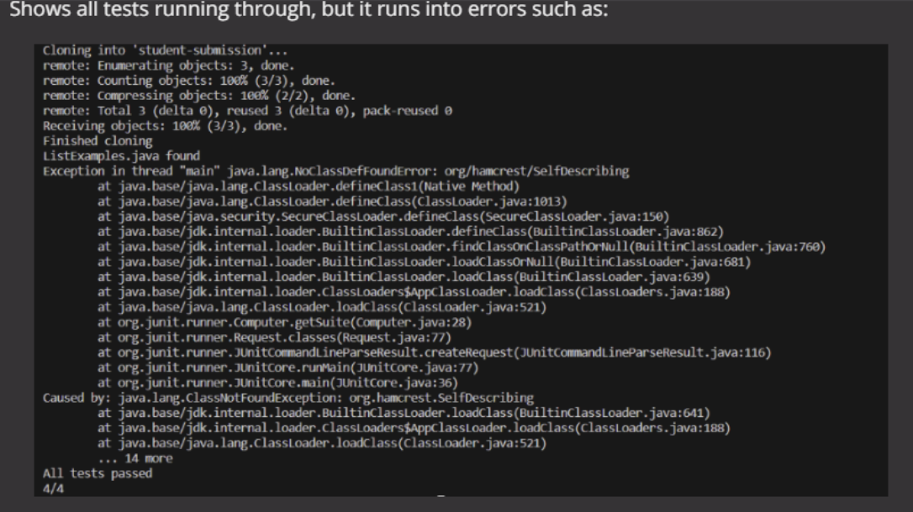
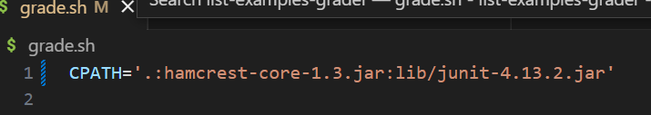
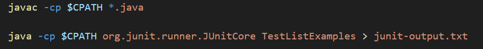
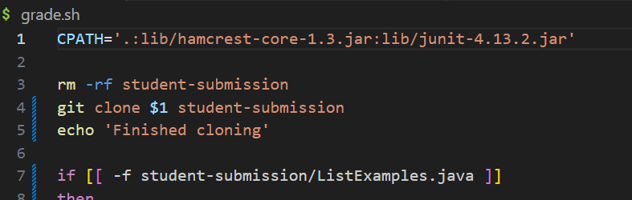
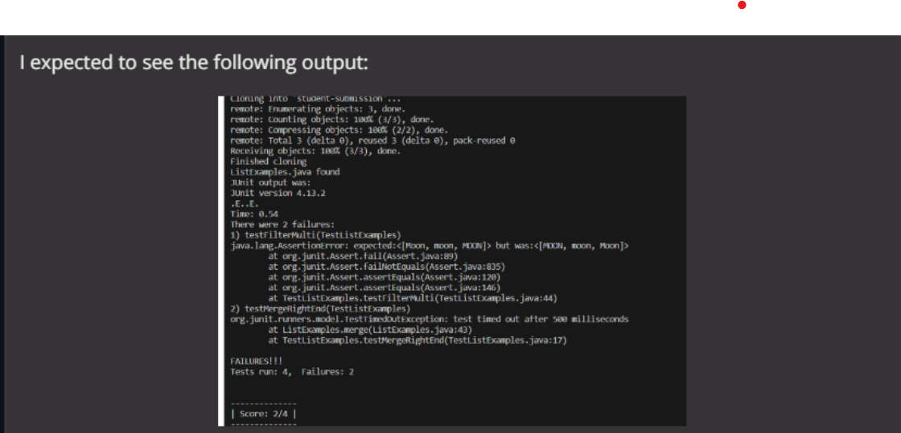

# Lab Report 5
***

## 1. EdStem Post (bug):




***

## 2. TA Response (Mock):

Question Asked (for more reference): May I please see the rest of your code, specifically where the compiler for your pathway exists within your bash script of the file ListExamples.java that you were asked to work with. This is usually the lines of code that include javac and java and or CPATH if included?

Following code lines shown:


**And**


I have noticed that you are trying to recieve an output that is different based on the compiler behavior and In the bash file, it seemed like the CPATH was the wrong path to the JUnit testing file (the hamcrest file). Instead of going into lib to go into the file, it tries to only go to the file which is why you see this error in your terminal output:


My suggestions for you: Check into the compiler lines and see how you can modify the grade.sh file by its CPATH at the top of your code where your compile code lines exist so the change looks something such as: `CPATH='.:hamcrest-core-1.3.jar:lib/junit-4.13.2.jar'` to `CPATH='.:lib/hamcrest-core-1.3.jar:lib/junit-4.13.2.jar`. After you should run and compile the bash script again - `bash grade.sh https://github.com/ucsd-cse15l-f22/list-methods-lab3` and see if that works, if not please post another question and I'll into it.
***

## 3. Student Output:

After, the code change should look like:



The Terminal Output from the respective change:



We need to specify the path where we want to run the Junit, which is in the lib path as the error above stated it must have been an error lead by an incorrect path for your code to compile as the lib directory is not specified. The error says that it cannot find the hamcrest file because the lib directory is not specified. CPATH is assigned to the value `'.:hamcrest-core-1.3.jar:lib/junit-4.13.2.jar` when it should actually be `'.:lib/hamcrest-core-1.3.jar:lib/junit-4.13.2.jar”` with `lib/` added at the beginning of the compiler pathway as it caused the error - NoClassDefFoundError. 
***

## 4. Resources Used (background)

1. The file used was from the list-examples-grader repository found in this [link](https://github.com/ucsd-cse15l-f22/list-examples-grader.git) 
2. Directory Structure: 

**List-Examples-Grader**
  **lib**
    hamcrest-core-1.3.jar
    junit-4.13.2.jar
  **student-submission**
    ListExamples.java
  **grade.sh
  GradeServer.java
  junit-output.txt
  ListExamples.java
  Server.java
  TestListExamples.java**

3. Contents of grade.sh before error fix:
```
CPATH='.:hamcrest-core-1.3.jar:lib/junit-4.13.2.jar'

rm -rf student-submission
git clone $1 student-submission
echo 'Finished cloning'

if [[ -f student-submission/ListExamples.java ]]
then
  echo 'ListExamples.java found'
else
  echo 'ListExamples.java not found'
  echo 'Score: 0/4'
fi

cp student-submission/ListExamples.java ./

javac -cp $CPATH *.java

java -cp $CPATH org.junit.runner.JUnitCore TestListExamples > junit-output.txt

# The strategy used here relies on the last few lines of JUnit output, which
# looks like:

# FAILURES!!!
# Tests run: 4,  Failures: 2

# We check for "FAILURES!!!" and then do a bit of parsing of the last line to
# get the count
FAILURES=`grep -c FAILURES!!! junit-output.txt`

if [[ $FAILURES -eq 0 ]]
then
  echo 'All tests passed'
  echo '4/4'
else
  # The ${VAR:N:M} syntax gets a substring of length M starting at index N
  # Note that since this is a precise character count into the "Tests run:..."
  # string, we'd need to update it if, say, we had a double-digit number of
  # tests. But it's nice and simple for the purposes of this script.

  # See, for example:
  # https://stackoverflow.com/questions/16484972/how-to-extract-a-substring-in-bash
  # https://www.gnu.org/savannah-checkouts/gnu/bash/manual/bash.html#Shell-Parameter-Expansion

  RESULT_LINE=`grep "Tests run:" junit-output.txt`
  COUNT=${RESULT_LINE:25:1}

  echo "JUnit output was:"
  cat junit-output.txt
  echo ""
  echo "--------------"
  echo "| Score: $COUNT/4 |"
  echo "--------------"
  echo ""
fi
```
4.


