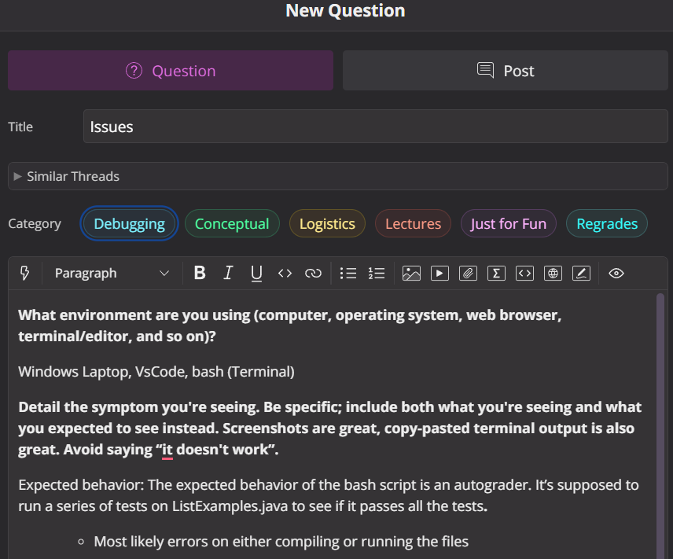
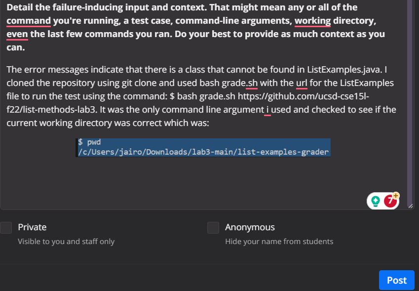
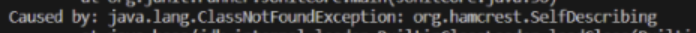

# Lab Report 5
***

## 1. EdStem Post (bug):

***

## 2. TA Response (Mock):

Question Asked (for more reference): May I please see the rest of your code, specifically where the compiler for your pathway exists within your bash script of the file ListExamples.java that you were asked to work with. This is usually the lines of code that include javac and java and or CPATH if included?

I have noticed that you are trying to recieve an output that is different based on the compiler behavior and In the bash file, it seemed like the CPATH was the wrong path to the JUnit testing file (the hamcrest file). Instead of going into lib to go into the file, it tries to only go to the file which is why you see this error in your terminal output:

 My suggestions for you: Modify the grade.sh file by adding “lib/” into the CPATH at the top of your code where your compile code lines exist so the change looks something such as: `CPATH='.:hamcrest-core-1.3.jar:lib/junit-4.13.2.jar'` to `CPATH='.:lib/hamcrest-core-1.3.jar:lib/junit-4.13.2.jar`, which is just adding. We need to specify the path where we want to run the Junit, which is in the lib path as the error above stated it must have been an error lead by an incorrect path for your code to compile as the lib directory is not specified. 
 
***

